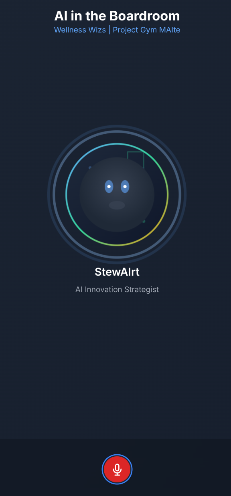

# AI in the Boardroom - StewAIrt

## Overview

"AI in the Boardroom - StewAIrt" is an interactive AI personal trainer app simulation designed for board-level discussions within a health tech company, 'Wellness Wizs'. This application demonstrates the capabilities and considerations of deploying AI initiatives, particularly focusing on opportunities and critical pitfalls like data privacy, potential for physical injury from incorrect recommendations, and algorithmic bias.

StewAIrt, an AI Innovation & Risk Strategist, acts as a virtual board member, providing concise, spoken summaries on complex AI topics. The application features a dynamic AI avatar that reacts to the conversation, offering a natural and engaging experience.

This project uses FastAPI for the backend, serving a static HTML/JavaScript frontend, and leverages WebSockets for real-time, bidirectional communication with a conversational AI agent powered by the Google ADK (Agent Development Kit). Audio input and output are handled via Web Audio API Worklets for a seamless voice-enabled interaction.

To give you an idea of the app's appearance:




## Deployment to Google Cloud Run

Follow these steps to deploy the "AI in the Boardroom - StewAIrt" application to Google Cloud Run.

### Prerequisites

Before you begin, ensure you have the following installed and configured:

1.  **Google Cloud SDK (`gcloud` CLI):**
    * Install it from [Google Cloud SDK Documentation](https://cloud.google.com/sdk/docs).
    * Authenticate your `gcloud` CLI: `gcloud auth login`
    * Set your default Google Cloud project: `gcloud config set project [YOUR_PROJECT_ID]`

2.  **Docker:** Install Docker Desktop (or Docker Engine) from [Docker's Website](https://www.docker.com/get-started).

3.  **Google Cloud Project:** Ensure you have an active Google Cloud Project with the **Cloud Run API** and **Artifact Registry API** enabled.

4.  **Vertex AI Configuration (`.env`):**
    * Your application uses Vertex AI for its AI models. Your Google Cloud Project ID and desired location are needed for this configuration. These values **must not** be committed to your public Git repository.
    * Create a file named `.env` in the root directory of your project (the same directory as `main.py` and `Dockerfile`).
    * Add your Vertex AI configuration to this file in the following format:
        ```
        GOOGLE_GENAI_USE_VERTEXAI=TRUE
        GOOGLE_CLOUD_PROJECT="your-google-cloud-project-id"
        GOOGLE_CLOUD_LOCATION="your-google-cloud-region"
        ```
    * **Important:** Replace `"your-google-cloud-project-id"` with your actual Google Cloud Project ID and `"your-google-cloud-region"` (e.g., `us-central1`) with the region where you plan to use Vertex AI models.
    * Ensure `.env` is included in your `.gitignore` file to prevent accidental commits.

### Deployment Steps

1.  **Create an Artifact Registry Repository:**
    Before you can push your Docker image, you need an Artifact Registry repository to store it. Create a new Docker repository (e.g., named `stewairt`) in your desired region.

    ```bash
    gcloud artifacts repositories create stewairt \
      --repository-format=docker \
      --location=us-central1 \
      --description="Docker repository for StewAIrt application images"
    ```
    * `stewairt`: This is the name for your repository. You can choose a different name if you wish, but remember to update it in subsequent commands.
    * `us-central1`: This is the region where the repository will be located. Choose a region close to your Cloud Run deployment for best performance.

2.  **Configure Docker for Artifact Registry:**
    Authenticate Docker to push images to your Google Cloud Artifact Registry. You only need to run this once per machine:

    ```bash
    gcloud auth configure-docker us-central1-docker.pkg.dev
    ```

    *Ensure the `us-central1` region matches the location of the repository you created.*

3.  **Build the Docker Image:**
    Navigate to the root directory of your project (where `Dockerfile` and `main.py` are located) and build the Docker image. This command tags the image for your Artifact Registry repository.

    ```bash
    docker build -t us-central1-docker.pkg.dev/[YOUR_PROJECT_ID]/stewairt/stewairt-app:latest .
    ```

    * **Important:** Replace `[YOUR_PROJECT_ID]` with your actual Google Cloud Project ID in this command and the following ones.

4.  **Push the Docker Image to Artifact Registry:**
    Upload your built Docker image to Artifact Registry.

    ```bash
    docker push us-central1-docker.pkg.dev/[YOUR_PROJECT_ID]/stewairt/stewairt-app:latest
    ```

5.  **Deploy to Google Cloud Run:**
    Now, deploy the image from Artifact Registry to Cloud Run. The `--port 8080` argument is critical as your Dockerfile is configured to listen on this port.

    ```bash
    gcloud run deploy stewairt-app \
      --image us-central1-docker.pkg.dev/[YOUR_PROJECT_ID]/stewairt/stewairt-app:latest \
      --platform managed \
      --region us-central1 \
      --allow-unauthenticated \
      --port 8080
    ```

    * `stewairt-app`: This is the name your Cloud Run service will have.
    * `--image`: Specifies the full path to the Docker image in Artifact Registry.
    * `--platform managed`: Uses the fully managed Cloud Run environment.
    * `--region us-central1`: Choose your desired Google Cloud region. Ensure it matches your Artifact Registry region and the region where your repository was created.
    * `--allow-unauthenticated`: Makes your service publicly accessible via HTTP(S). For production, consider stronger authentication methods if needed.
    * `--port 8080`: This *must* match the port your application listens on inside the container (as defined in your `Dockerfile`'s `CMD`). Cloud Run will route external traffic to this internal port.

    The `gcloud run deploy` command will prompt you to enable APIs if they aren't already, and confirm deployment details. Once complete, it will provide you with the URL of your deployed application.

You can now access your "AI in the Boardroom - StewAIrt" application via the provided Cloud Run URL!

## Known Issues

1.  **Resource Exhaustion with Google Search Tool:**
    * The `Google Search` tool within the AI agent can occasionally lead to resource exhaustion errors. For this reason, the `Google Search` tool has been temporarily disabled in the `agent.py` configuration.

2.  **Conversation Lag After Reconnection:**
    * A known issue causes noticeable lag in the conversation flow if the user disconnects the microphone and then reconnects it during an active session.
    * **Workaround:** To resolve this, simply refresh the web page after encountering the lag. This will re-establish a fresh connection and restore smooth performance.